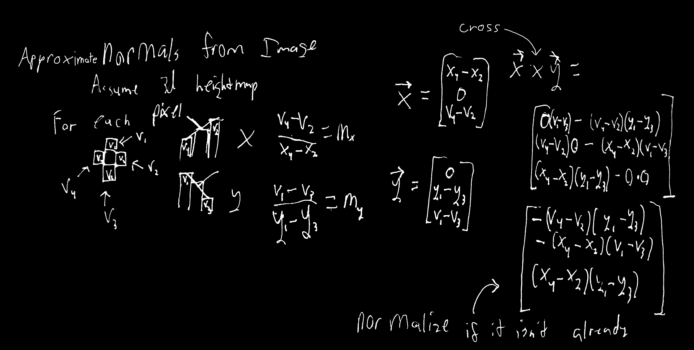
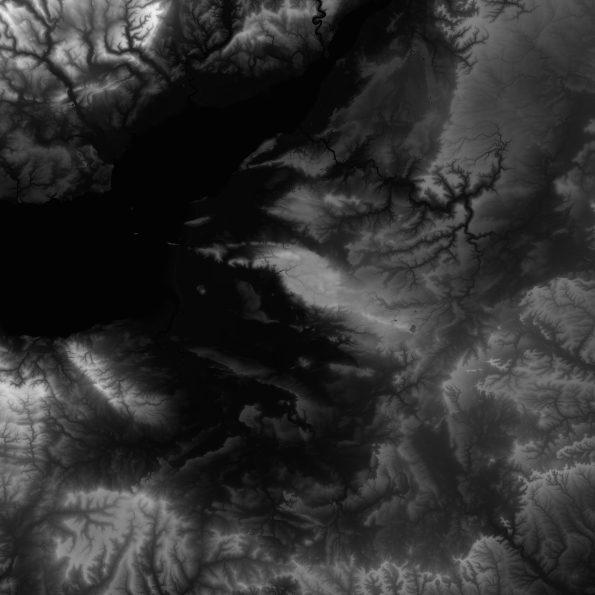
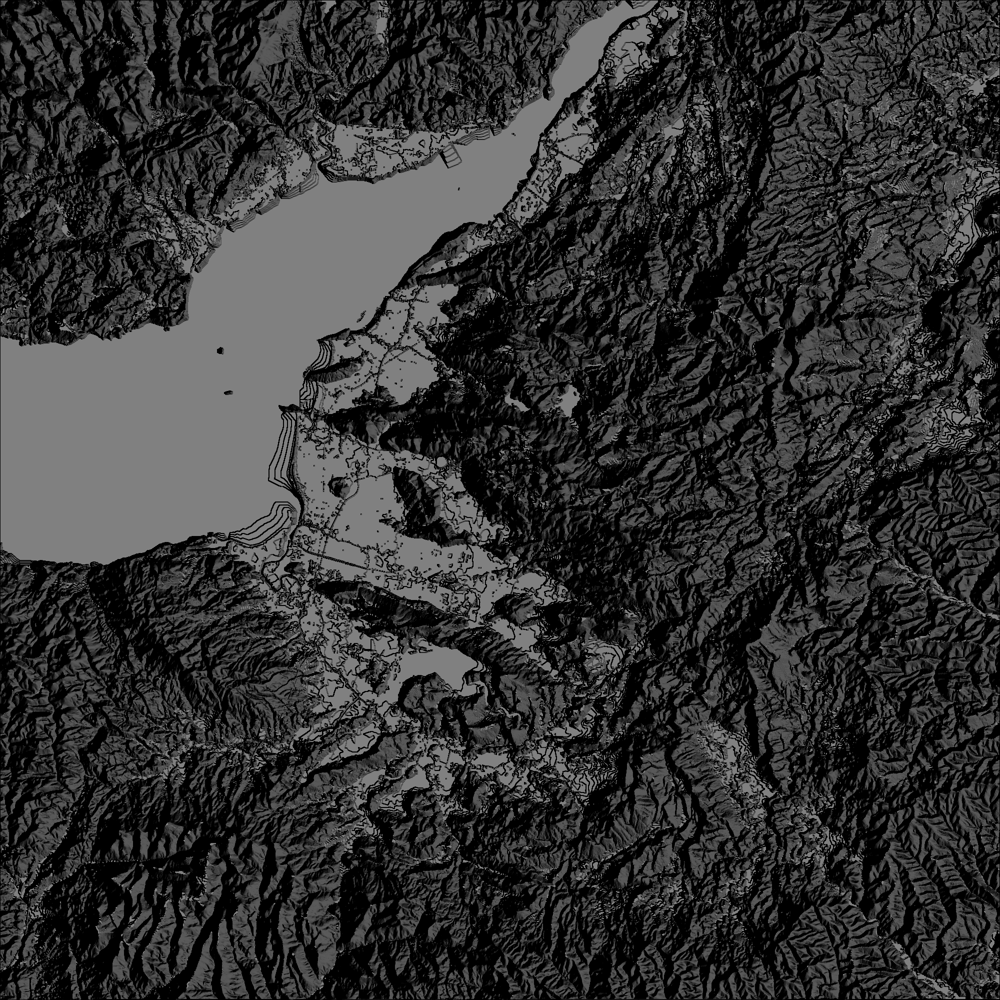

# Normal Maps
A custom implementation to get a [normal map](https://en.wikipedia.org/wiki/Normal_mapping) from an image.

(Note: in the actual code, I ***also*** use the "corner pixels" to the top left, top right, bottom right, and bottom left of the current pixel.)

## In Action
Heightmap ([source](https://www.reddit.com/r/CitiesSkylines/comments/37y82s/any_interest_in_uk_heightmap_generator_that_uses/)):

Normal map produced:

Running a simple [Lambertian Diffuse](https://en.wikipedia.org/wiki/Lambert's_cosine_law):

